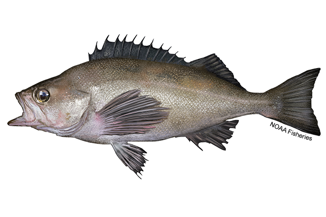

## 2025 Update Assessment - Widow Rockfish

This repository contains code, (non-confidential) data, and derived outputs to generate the 2025 update assessment report for the widow rockfish stock off of the U.S. west coast.

## Directory structure:

Some data needed to run R code in this repository is confidential and therefore not provided here. However, all data needed to run the assessment models herein and generate the assessment report are aggregated to a non-confidential level and tracked on the remote; to build the assessment from these derived datasets simply source `make.R` with the `jobs$data` flag set to `FALSE`.

The contents of this repository are as follows:

-   :file_folder: `R` Code for generating derived data products and figures
-   :file_folder: `data_provided` Data products from scientific surveys, state agencies, and past assessments
-   :file_folder: `data_derived` Processed data files for use as inputs to Stock Synthesis
-   :file_folder: `models` Stock Synthesis model input files
-   :file_folder: `figures` Figures for assessment update
-   :file_folder: `report` Quarto source code for rendering the report (saved as `report/WIDOW_SAR_2025.pdf`)
-   :file_folder: `doc` Relevant documents
-   :file_folder: `scratch` Assorted scripts that do not produce inputs or figures for the assessment update

Please cite the contents of this repository or the associated assessment report as:

Kinneen, M., Goodman, M. C., Sulc, A., Balstad, L., Diaz, R., Randrup, K., Patrone, W., Spencer, L., Morell, A., Rovellini, A., Dedrick, A., Grunloh, N., Bargas, M., Hopkins, S., Gersteva, V., Oken, K., Taylor, I., Haltuch, M., \& Hamel, O. (2025) Status of widow rockfish stock off the U.S. West Coast in 2025. Pacific Fishery Management Council, Portland, Oregon.

## Disclaimer

This repository is a scientific product and is not official communication of the National Oceanic and Atmospheric Administration, or the United States Department of Commerce. All NOAA GitHub project code is provided on an ‘as is’ basis and the user assumes responsibility for its use. Any claims against the Department of Commerce or Department of Commerce bureaus stemming from the use of this GitHub project will be governed by all applicable Federal law. Any reference to specific commercial products, processes, or services by service mark, trademark, manufacturer, or otherwise, does not constitute or imply their endorsement, recommendation or favoring by the Department of Commerce. The Department of Commerce seal and logo, or the seal and logo of a DOC bureau, shall not be used in any manner to imply endorsement of any commercial product or activity by DOC or the United States Government.
