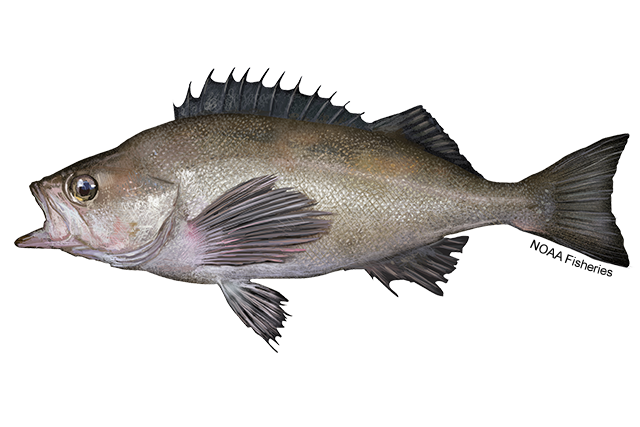

<!-- low-tech way to add affiliations to quarto doc --> 
1. NOAA Fisheries Northwest Fisheries Science Center, 2725 Montlake Boulevard East, Seattle, WA, 98112
2. School of Aquatic & Fishery Sciences (SAFS), University of Washington, 1122 NE Boat St, Seattle, WA, 98195

<!-- may need to change fig method to allow alt-text --> 


```{r}
#| label: setup
#| message: false
#| warning: false

library(here)
library(dplyr)
library(r4ss)

base_location <- here('models/2025 base model')
base_in <- SS_read(base_location)
base_out <- SS_output(base_location, verbose = FALSE, printstats = FALSE, covar = FALSE)

# insert any other preamble code here
```

```{r, results='asis'}
#| label: 'disclaimer'
#| eval: true
#| echo: false
#| warning: false
a <- knitr::knit_child(here('report/00a_disclaimer.qmd'), quiet = TRUE)
cat(a, sep = '\n')

```

# New proposed base model

```{r, results='asis'}
#| label: 'new_base'
#| warning: false
a <- knitr::knit_child('new_base_description.qmd', quiet = TRUE)
cat(a, sep = '\n')
```

  

# Bridging from the August 2025 model to the new proposed base model

```{r, results='asis'}
#| label: 'bridging'
#| warning: false
a <- knitr::knit_child('bridging.qmd', quiet = TRUE)
cat(a, sep = '\n')
```

  

# Diagnostics from new proposed base model

```{r, results='asis'}
#| label: 'diagnostics'
#| warning: false
a <- knitr::knit_child('diagnostics.qmd', quiet = TRUE)
cat(a, sep = '\n')
```

  

# Projections for new proposed base model

```{r, results='asis'}
#| label: 'management'
#| warning: false
a <- knitr::knit_child('management.qmd', quiet = TRUE)
cat(a, sep = '\n')
```

# References

```{r, results='asis'}
#| label: 'references'
#| warning: false
a <- knitr::knit_child(here('report/07_references.qmd'), quiet = TRUE)
```
